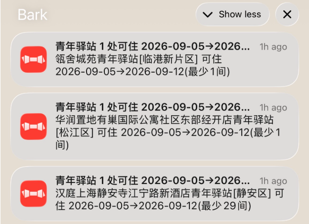
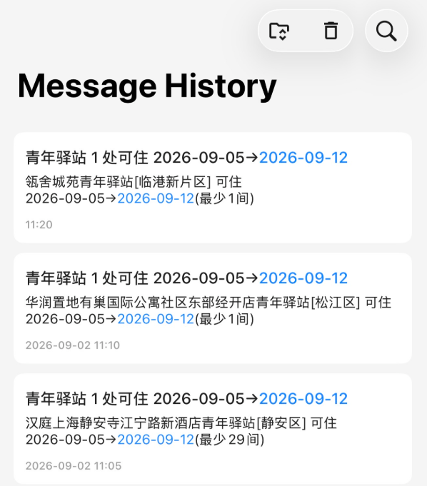

# 青年驿站房源监控 (qnyz-monitor)

定时监控上海青年驿站（`qnyz.shyouth.net` 用户端）的**可预约房源**，按条件过滤，发现新增可预约时通过 Webhook 推送到手机。

> 数据来自用户端**公开接口** `https://qnyz.shyouth.net/qnyzApi`，**无需登录、无需验证码**：
>
> - `POST /hous/housListBatch` — 驿站列表（名称、区域、地址、总房间数等）
> - `GET  /hous/calendar?id=` — 某驿站每日可预约数量 `applyNumber`（即“剩余房源”）

## 推送效果

命中后手机上收到的 Bark 通知——标题是「N 处可住 + 入住/离店区间」，正文一行一个驿站，带区域和该区间内的最少房量：

<table>
  <tr>
    <td align="center">通知横幅</td>
    <td align="center">Bark App 内的消息历史</td>
  </tr>
  <tr>
    <td></td>
    <td></td>
  </tr>
</table>

11:05、11:10、11:20 三条各自独立，是三轮检查分别发现的新增（外部定时每 5 分钟触发一次）；同一轮里命中多家会合并成一条。同一家驿站、同一个日期区间只推一次，不会重复轰炸（见「[去重逻辑](#去重逻辑)」）。

## 两种用法，二选一

|               | [用法一：本地运行](#用法一本地运行) | [用法二：GitHub Actions](#用法二github-actions电脑关机也能推送) |
| ------------- | ---------------------------------- | -------------------------------------------------------------- |
| 跑在哪        | 自己的电脑                         | GitHub 的服务器                                                |
| 电脑关机      | 停                                 | 照跑                                                           |
| 配置文件      | `config.yaml`（本地，不进仓库）  | `config.ci.*.yaml`（进仓库，不含密钥）                       |
| Bark key 放哪 | 直接写在`config.yaml` 里         | 仓库 Secret`BARK_URL`                                        |
| 定时怎么来    | 程序自己循环（`interval` 秒）    | 外部定时服务调 GitHub API                                      |
| 有图形界面吗  | 有，网页控制台                     | 没有，改 YAML                                                  |
| 适合          | 调条件、临时盯几小时               | 长期挂着                                                       |

两者互不依赖：**只用 Actions 的话不需要建 `config.yaml`**，反之亦然。

## 监控条件（两种用法通用）

两种用法的配置文件字段完全一样，区别只在文件名和密钥放哪。字段速查：

- `check_availability`：`true` 监控真正可预约（查每个驿站日历），`false` 只看列表/总房间数。
- `filters.districts`：按区域名过滤，如 `["浦东新区","徐汇区"]`，留空=全区。
- `filters.only_stations`：只盯指定的一家/几家，如 `["友间","1024"]`。每项可写驿站名关键字（名称包含即命中）或驿站 id（完全相等），留空=不限。
- `filters.name`：驿站名关键字，只能填一个。注意它是**服务端全字段模糊搜索**，连地址和区域一起匹配（实测 `"宝山"` 会命中 8 家，其中 5 家名字里根本没有"宝山"）。
- `filters.apply_scope`：申请类型 —— `all` 全部 / `personal` 仅个人可申请（排除仅集体）/ `group` 仅供集体申请。
  （判定方式：`housType=1` 返回全部房源，`housType=0` 返回可供个人申请房源，差集即“仅供集体申请”。网页表格会给这些驿站打「仅集体」标。）
- `filters.date_from` / `date_to`：入住 / 离店日期。
- `filters.min_apply_number` / `min_house_count`：可预约数量、总房间数的下限。
- `notify.type` / `notify.url`：推送渠道和地址，见下面「[通知渠道](#通知渠道两种用法通用)」。

**三个容易搞错的地方：**

- **`date_from`/`date_to` 是"连住整个区间"**，不是"这段时间里哪天有空"。它俩直接传给接口的 `startTime`/`endTime`，由服务器筛出**能住满整段**的驿站（和官网筛选一致）。想覆盖几个不同的连住区间，就拆成几组配置，别合并成一个大区间——区间越长命中越少。
- **两个日期都留空**则改为逐日判定：任意一天有空就推，但也不再限制日期范围。
- **只盯固定几家时，`only_stations` 写名称关键字比写 id 更耐用**：以后新开一家名字含该关键字的会自动纳入，id 是死名单。

查区域名和驿站 id/全名（需要先按「用法一」装好依赖，Actions 用户也可以在本地跑一次查完再填）：

```bash
python monitor.py --list-districts                          # 所有区域 + 各区驿站数
python monitor.py --list-stations                           # 所有驿站的 id / 名称 / 区域
python monitor.py --list-stations --config config.ci.a.yaml # 没有 config.yaml 时指定一个配置文件
```

## 通知渠道（两种用法通用）

### Bark（iOS，推荐）

1. **装 App**：App Store 搜「Bark」，免费。
2. **拿到你的推送地址**：打开 App，首页顶部就是一条 `https://api.day.app/xxxxxxxxxxxx/`，点一下可以复制。中间那串就是你的 **device key**。
3. **填进配置**：

   - 本地运行 → `config.yaml` 的 `notify.url`
   - GitHub Actions → 仓库 Secret `BARK_URL`（不要写进 `config.ci.*.yaml`，那个文件会进仓库）

   末尾的斜杠有没有都行，程序会自己去掉：

   ```yaml
   notify:
     type: "bark"
     url: "https://api.day.app/你的key"
   ```
4. **测一下通不通**（不跑监控，直接发一条）：

   ```bash
   curl -X POST https://api.day.app/你的key \
     -H 'Content-Type: application/json' \
     -d '{"title":"测试","body":"来自 qnyz-monitor"}'
   ```

   返回 `{"code":200,...}` 且手机收到通知就算通了。推送会归到「青年驿站」这个分组下（`notifier.py` 里写死的 `group`），在 Bark App 里可以按分组折叠。

> **key 就是推送权限**：任何人拿到它都能往你手机推消息。别提交进仓库、别截图带出去。真泄露了就在 Bark App 里点「重置设备 key」（或删掉重装），旧 key 立刻失效，记得同步更新配置和 Secret。
>
> 想完全自己掌控可以自建 [bark-server](https://github.com/Finb/bark-server)，把 `notify.url` 换成自己的域名即可，格式一样。

### 其他渠道

`notify.type` 改成对应值，`notify.url` 填对应地址即可：

| `notify.type` | `notify.url` 填什么                               |
| --------------- | --------------------------------------------------- |
| `bark`        | `https://api.day.app/<你的key>`                   |
| `serverchan`  | `https://sctapi.ftqq.com/<SENDKEY>.send`          |
| `wecom`       | 企业微信群机器人的 webhook 完整地址                 |
| `dingtalk`    | 钉钉群机器人的 webhook 完整地址                     |
| `generic`     | 任何能接收`POST {"title":..., "text":...}` 的地址 |

用 Actions 时，Secret 的名字仍然叫 `BARK_URL`（工作流里写死的），只是内容换成对应渠道的 webhook，同时改 `config.ci.*.yaml` 里的 `notify.type`。

---

# 用法一：本地运行

## 安装

```bash
git clone https://github.com/xukanz/qnyz-monitor.git
cd qnyz-monitor
python -m venv .venv
source .venv/bin/activate          # Windows: .venv\Scripts\activate
pip install -r requirements.txt
```

## 配置

```bash
cp config.example.yaml config.yaml
# 编辑 config.yaml：填 notify.url（Bark 地址怎么拿见上面「通知渠道」），按需设置 filters
```

`config.yaml` 在 `.gitignore` 里，不会被提交。本地独有的两个字段：

- `interval`：轮询间隔秒数（如 `300` = 5 分钟），Actions 版用不到。
- `log_file`：日志落地文件名，留空则只打屏幕。

其余字段见上面「[监控条件](#监控条件两种用法通用)」。

## 命令行

```bash
# 跑一次：打印当前可预约的驿站
python monitor.py --once --no-notify

# 跑一次：打印驿站列表原始 JSON
python monitor.py --once --raw

# 持续监控
python monitor.py

# 后台常驻
nohup python monitor.py >> qnyz_monitor.log 2>&1 &
```

## 网页控制台（推荐）

在网页上选条件、点按钮启停监控，不用改 YAML：

```bash
source .venv/bin/activate
python app.py                 # 默认 http://127.0.0.1:8765
# 局域网访问：python app.py --host 0.0.0.0 --port 8765
```

打开 `http://127.0.0.1:8765`：

- **筛选条件**：入住起止日期、每日可约数下限、申请类型、轮询间隔、区域多选。
- **指定驿站**：可勾选只盯某一家或某几家（不勾=全部）。列表带搜索框，并跟着区域/申请类型实时收窄；因条件变化而不再符合的会自动取消勾选。网页不提供「名称关键字」，按名字筛用这里勾选即可（`filters.name` 仍供 CLI / Actions 使用）。
- **🔍 预览当前可约**：立即按条件查询并列表展示（不发通知、不影响去重状态）。
- **▶ 启动监控 / ⏹ 停止监控**：后台按间隔轮询，命中新增可预约就走 Bark 推送。
- 状态区显示运行中/已停止、上次检查时间、可约驿站数、本轮新增数。

> 通知（Bark 等）与 `verify_ssl` 仍从 `config.yaml` 读取；网页只控制过滤条件与轮询间隔。
> 点「停止」若正处于一次网络抓取中，会在当前这轮结束后停下（几秒内）。

---

# 用法二：GitHub Actions（电脑关机也能推送）

让监控跑在 GitHub 服务器上，定时检查、命中就推送。仓库已内置工作流 `.github/workflows/monitor.yml`。

**这条路不需要 `config.yaml`** —— 工作流跑的是 `python monitor.py --once --config config.ci.a.yaml`，走不到默认配置那条路径。

## 搭建步骤

1. **Fork 或使用本仓库**（你自己的账号下）。
2. **添加 Bark（或其他 Webhook）地址为仓库 Secret**，名字必须是 `BARK_URL`：

   ```bash
   gh secret set BARK_URL --repo <你的用户名>/qnyz-monitor --body "https://api.day.app/<你的key>"
   ```

   或网页：仓库 → Settings → Secrets and variables → Actions → New repository secret，Name 填 `BARK_URL`。

   > Secret 加密存储、不可读回、不进代码；工作流运行时注入为环境变量 `QNYZ_NOTIFY_URL`。
   > 用其他通知渠道：把 `BARK_URL` 填成对应 webhook，并在对应 `config.ci.*.yaml` 改 `notify.type`（bark/serverchan/wecom/dingtalk/generic）。
   >
3. **改监控条件**：编辑对应的 `config.ci.*.yaml`，`git push` 即生效。写法见下面「[`config.ci.*.yaml` 怎么写](#configciyaml-怎么写)」。
4. **定时怎么来**：见下面「[定时触发](#定时触发首选外部服务schedule-是替代方案)」——二选一，**首选**外部定时服务调 API（准点、可 5 分钟一次），用不了再换成 GitHub 自带 `schedule`。
5. **手动跑一次**：

   ```bash
   gh workflow run monitor.yml --repo <你的用户名>/qnyz-monitor
   ```

   也可在仓库 **Actions** 页面点 Run workflow。
6. **暂停 / 恢复推送**：**去定时服务（cron-job.org）里把那条任务 Pause**。它是唯一的定时源（`schedule` 注释停用中），掐掉源头最干净，GitHub 侧不留任何痕迹，恢复时点回来即可。

   不要用 `gh workflow disable` 来做常规暂停：workflow 被停用后，定时服务的调用会收到 **403 "This workflow is disabled"**，那边的任务一直标红、失败次数累积，长期下去可能被定时服务自己关掉。它只适合当强制闸门——你不方便动定时服务，或怀疑还有别的东西在触发这个 workflow：

   ```bash
   gh workflow disable monitor.yml --repo <你的用户名>/qnyz-monitor   # 强制停用
   gh workflow enable  monitor.yml --repo <你的用户名>/qnyz-monitor   # 恢复
   ```

   彻底不用了：删掉定时服务的任务，并去 GitHub 设置里 **Revoke 那个 PAT**。

   > 暂停超过 **7 天**，Actions 缓存里的去重状态会被 GitHub 清理（缓存 7 天未访问即淘汰）。恢复后的第一轮会把当时所有符合条件的驿站当成新增，一次性推给你。
   >

## 定时触发：首选外部服务，schedule 是替代方案

两种定时方式，**二选一**，本仓库当前用的是外部服务：

|                                    | 入口                  | 间隔                           | 准点吗                     | 当前状态 |
| ---------------------------------- | --------------------- | ------------------------------ | -------------------------- | -------- |
| **首选** 外部定时服务        | `workflow_dispatch` | 自己定，可低至**5 分钟** | 准点                       | 启用     |
| **替代** GitHub `schedule` | `schedule`          | 每小时（`23 * * * *`）       | 不保证，常延迟甚至整轮跳过 | 注释停用 |

没必要两条都开——同时开只是多跑几遍（去重状态共用，不会重复推）。

### 首选：外部定时服务调 GitHub API

1. **创建细粒度 PAT**：https://github.com/settings/personal-access-tokens/new

   - Repository access → Only select repositories → 选本仓库
   - Permissions → Repository permissions → **Actions: Read and write**（其他都不给）
   - 生成后复制 `github_pat_...`（只显示一次）
2. **在定时服务里建任务**（如 https://cron-job.org ，免费）：

   | 项       | 值                                                                                                  |
   | -------- | --------------------------------------------------------------------------------------------------- |
   | URL      | `https://api.github.com/repos/<你的用户名>/qnyz-monitor/actions/workflows/monitor.yml/dispatches` |
   | Method   | `POST`                                                                                            |
   | Schedule | **每 5 分钟**（想更省可以放到 10 分钟）                                                       |
   | Body     | `{"ref":"main"}`                                                                                  |

   Request headers：


   ```
   Accept: application/vnd.github+json
   Authorization: Bearer github_pat_你的token
   X-GitHub-Api-Version: 2022-11-28
   Content-Type: application/json
   ```

   成功时 GitHub 返回 **204 No Content**（无响应体即正常）。

> - PAT 等同密码：只放在定时服务的配置里，**不要提交进仓库**；泄露就去 GitHub 设置 Revoke。
> - PAT **到期后定时会静默失效**（GitHub 侧毫无动静，只有定时服务那边显示 401），记得续期或去看一眼。
> - 改监控条件只需改 `config.ci.*.yaml` 并 push，**无需改动定时服务**。
> - 公开仓库跑 Actions 不计费，5 分钟一次不用担心额度；私有仓库要算 2000 分钟/月的免费额度。

### 替代：改用 GitHub 自带 schedule

**什么时候换过去**：不想折腾 PAT 和外部服务、cron-job.org 停了或开始收费、PAT 过期又懒得续。

`.github/workflows/monitor.yml` 里已经写好，注释停用中，取消这两行注释即可：

```yaml
schedule:
  - cron: "23 * * * *"      # 每小时一次
```

同时把外部定时服务那边的任务停掉，避免白跑。

**换过去要接受的代价**：GitHub 官方明确说 schedule 不保证执行；本仓库实测 `*/10` 和每 30 分钟的 cron **一次都没触发过**（高频 cron 常被整体跳过）。所以这里给的是每小时——**频率越低越容易被真的执行**，但依然会延迟几分钟到几十分钟。想抢房源的话，这个间隔基本只能算"有总比没有强"。

- 想调频率：改 `cron`（用 UTC，不是北京时间）。
- 仓库 **60 天无提交**，GitHub 会自动停用 schedule，需要重新 enable 或偶尔 push 一下保活（`workflow_dispatch` 不受此限制）。

## `config.ci.*.yaml` 怎么写

Actions 每组条件一个配置文件，字段和本地 `config.yaml` 完全一样，只有三点不同：**不写密钥**、**不需要 `interval`**、**不写日志文件**。

完整模板，可直接复制成 `config.ci.<组名>.yaml` 再改：

```yaml
# 监控组 A：入住 9/5 → 离店 9/12，仅个人，全区
# 不含密钥；Bark key 由 Actions Secret（BARK_URL）注入。

base_url: "https://qnyz.shyouth.net/qnyzApi"
verify_ssl: false          # CI 里关掉证书校验，规避证书链问题
check_availability: true   # 查每个驿站的日历，监控"真正可预约"
concurrency: 10            # 查日历的并发数

filters:
  name: ""                 # 驿站名关键字，服务端模糊匹配（实为全字段搜索，含地址/区域）
  user_type: 2             # 2=个人，一般不用改
  apply_scope: "personal"  # all 全部 / personal 仅个人可申请 / group 仅供集体
  districts: []            # 区域白名单，如 ["浦东新区","徐汇区"]，留空=全区
  only_stations: []        # 只盯某一家/几家：驿站名关键字或 id，留空=不限
  date_from: "2026-09-05"  # 入住日期
  date_to: "2026-09-12"    # 离店日期
  min_house_count: 0       # 总房间数下限，0=不限
  min_apply_number: 1      # 某日可约数 ≥ 此值才算"可约"

notify:
  type: "bark"             # bark / serverchan / wecom / dingtalk / generic
  url: ""                  # 留空！运行时由 Secret 注入

log_file: ""               # CI 里不落地日志，直接打到 Actions 控制台
```

CI 特有的几个坑（字段含义见「[监控条件](#监控条件两种用法通用)」）：

- **`notify.url` 必须留空。** `monitor.py` 启动时会用环境变量 `QNYZ_NOTIFY_URL`（来自 Secret `BARK_URL`）覆盖它。写死在文件里 = 把你的 Bark key 提交进公开仓库。
- **没有 `interval`。** CI 是 `--once` 跑一次就退出，间隔由外部定时服务决定，配 `interval` 也不生效。
- **文件名随意**，但要和 workflow 里 matrix 的 `config:` 对上。缓存 key 用的是 matrix 的 `name`，改 `name` 等于换一份去重状态（会重新推一轮）。

## 同时监控多组条件（matrix）

工作流用 `strategy.matrix` 并行跑多组条件，每组一个配置文件、**各自独立的去重缓存**（key 前缀含组名，互不覆盖）。内置两组示例：

- `config.ci.a.yaml` — A 组
- `config.ci.b.yaml` — B 组

**增删组**：在 `.github/workflows/monitor.yml` 的 `matrix.include` 里加/减一项，并配一个对应的 `config.ci.<名>.yaml`：

```yaml
matrix:
  include:
    - name: A
      config: config.ci.a.yaml
    - name: B
      config: config.ci.b.yaml
    # - name: C            # 再加一组就照这样加
    #   config: config.ci.c.yaml
```

> 各组推送标题自带入住/离店日期，手机上可区分是哪组。

**说明与注意：**

- 去重状态 `state.json` 用 `actions/cache` 跨次保存（滚动缓存），因此定时版同样"只推新增、不重复"；每组用独立缓存 key（`qnyz-state-<组名>-`）。缓存与触发方式无关，换成 `schedule` 也接着用同一份状态。
- 工作流有 `concurrency: qnyz-monitor` 且 `cancel-in-progress: false`：上一轮还没跑完就来了新触发时会排队串行，不会并发写同一份缓存。5 分钟一次的间隔远大于单轮耗时（约 1 分钟），正常不会排队。
- `verify_ssl: false`：CI 环境拿的是公开只读数据，关掉证书校验以规避潜在证书链问题；本地要校验可在 `config.yaml` 单独设置。

---

# 参考

## 去重逻辑

两种用法共用同一套逻辑（本地存 `state.json` 文件，Actions 存 `actions/cache`）。

`state.json` 记录每个驿站上一轮的「命中指纹」，只有指纹里出现新内容才推送。指纹有两种，取决于有没有配入住/离店区间：

- **配了 `date_from` / `date_to`**：指纹就是这个区间本身。含义是「这家能住满 9/5→9/12」**从无到有**时推一次，之后一直可住都不再推。改了日期区间 = 指纹变了，会重推一轮。
- **两个都留空**：指纹是该驿站当前的可预约日期集合，出现**新日期**才推。日期减少、或同一天房量变化都不推。

本轮结果里没有的驿站会从状态中清除，所以"被订光了又放出来"会重新通知一次。删除 `state.json` 可重置；Actions 上改掉 matrix 里的组名 `name` 等效（换了缓存 key 前缀）。

## 字段说明（housListBatch 返回）

`id, xmid, name(驿站名), dizhi(地址), lxfs(电话), district(区域), houseCount(总房间数), zujin(租金), mianji(面积), peitaosheshi(配套), blurb(简介), longitude/latitude, isOnShelf(是否上架), …`

日历 `calendar` 返回 `[{applyDate, applyNumber}, ...]`，`applyNumber>0` 即该日期可预约。

## 结构

- `monitor.py` — 轮询主循环 + 过滤 + 去重 + 通知（CLI 与网页共用 `run_once`）
- `qnyz_client.py` — 公开接口封装（列表 + 日历）
- `notifier.py` — Webhook 推送
- `app.py` — 网页控制台（Flask，选条件 + 启停 + 预览）
- `config.example.yaml` — 本地配置模板（复制为 `config.yaml`）
- `config.ci.a.yaml` / `config.ci.b.yaml` — GitHub Actions 各组配置（不含密钥）
- `.github/workflows/monitor.yml` — 定时监控工作流（matrix 并行多组）
- `docs/` — README 用的截图
